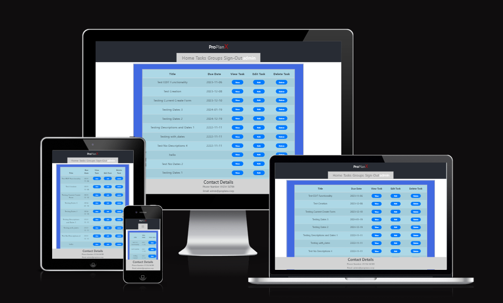
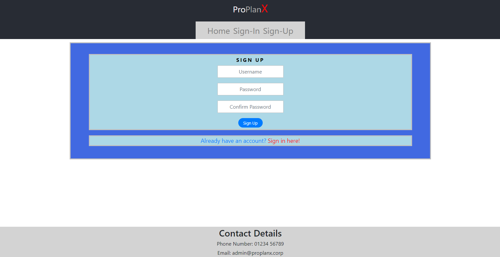

# PROJECT 5 - PRODUCTIVITY PLANNER 'PROPLANX' FRONT-END

In all walks of life, one finds themselves burdened with tasks and projects that they must complete within a limited timeframe - sometimes as little as a week, sometimes as much as a year, but limited nonetheless - and while sometimes they may benefit from a group to work alongside, other times they must handle such matters alone. The ProPlanX app allows the user to record and manage such things. 



If you wish to view the final project itself, it was deployed to Heroku, and can be found here: [Deployed ProPlanX Project](https://project-5-proplanx-536622b745e3.herokuapp.com/)

If alternatively you wish to view the GitHub repo for this project, it can be found here: [ProPlanX GitHub](https://github.com/KeyWarden/Project-5-Productivity-Planner-Resubmission)

Finally, if you wish to view the README for the backend of this project, you can do so here: [Backend README](README.md)

---

## CONTENTS

* [User Stories](#user-stories)

* [Features](#features)
  * [General Features on Each Page](#general-features-on-each-page)
  * [Future Implementations](#future-implementations)
  * [Accessibility](#accessibility)
  * [Home Page](#home-page)
  * [Sign-in/Sign-up](#sign-insign-up)
  * [Tasks/Groups](#tasksgroups)
  * [Specific Task/Group](#specific-taskgroup)
  * [Create/Edit Task/Group](#createedit-taskgroup)
  * [Not The Owner](#not-the-owner)

* [Technologies Used](#technologies-used)
  * [Languages Used](#languages-used)
  * [Frameworks Used](#frameworks-used)

* [Deployment](#deployment)

* [Testing](#testing)

* [Credits](#credits)
  * [Code Used](#code-used)
  * [Acknowledgments](#acknowledgments)

---

## User Stories

A selection of User Stories were made for the purposes of both the frontend and backend of this project. Here, I'm going to cover those that influenced the frontend, as well as whether they were designated Must Have, Should Have, or Could Have:

1. (Must Have) As a new customer, I would like to be immediately and clearly directed to the sign-up options so that I can get an account as quickly and easily as possible, as well as directed to sign-in similarly quickly so I can get back to managing my Tasks right away.
2. (Must Have) As a returning customer, I would like to be presented with the ability to edit, remove, add, or otherwise change my Tasks upon being presented with them, so that I can easily manage them in detail.
3. (Must Have) As a returning customer, I would like to be able to assign Tasks to Groups, in order to clearly show which Groups are assigned to which Tasks. And as a returning customer, I would like to be able to be able to easily edit, add, remove, or otherwise change my Groups, so that I can manage them in detail.
4. (Must Have) As a new customer, I would like to be immediately presented with ways to see my Tasks as soon as I sign in, so that I can immediately see which Tasks I have remaining and manage them.
5. (Must Have) As the client, I want the app to be easily viewable on a range of devices so as to not hinder the accessibilty of the app for non-desktop users.
6. (Should Have) As the client, I want there to be a clear way for users to contact the admin team in the event they should need to do so, such as to request admin assistance.
  * Shared With: As a returning customer, I would like to be able to contact the admin team in some way so as to get administrator support if a feature of the site is not functioning or I am currently indisposed.
7. (Should Have) As a returning customer, I would like to be able to search through my Tasks in order to quickly find specific Tasks I am looking for.
  * I was only able to partially implement this User Story due to time constraints. All that could be implemented was ordering the Tasks by Due Date, and filtering what Tasks and Groups the user can see so they only see the Tasks and Groups they created.
8. (Should Have) As a returning/new customer, I would like to be notified if the deadline for my Tasks is approaching or has already passed, so as to be informed of how much time I have left to finish them, as well as if I need to delay them.
  * This User Story had to be dropped due to time constaints.
9. (Could Have) As a new customer, I would like to be able to access any socials or other web options for the app so that I can learn more about them if I should wish to do so.
  * This User Story had to be dropped due to time constaints and lacking need.

## Features

This app is composed of 12 pages represented by various React components. The are as follows:

* Home
* Sign-in
* Sign-up
* Tasks
* Groups
* Specific Task
* Specific Group
* Create Task
* Create Group
* Edit Task
* Edit Group
* Not The Owner

This app also uses certain reusable React components. These are:

* NavBar.js - This displays the Navbar and whether or not the user is signed-in.
* Deleted.js - This controls the DELETE functionality for Tasks and Groups.
* GroupTaskTitle.js (found in the groups subfolder fo the pages folder) - This displays the Title of a Task a Group has attached to.

### General features on each page

The Navbar and the Footer are the only general features found on every page.

* Navbar - the exact appearance of the Navbar changes absed on whether or not the user is signed in as well as the screen size. When not signed in, the Navbar will only show links to the Home, Sign-in and Sign-up pages. When signed in, it will show links to the Home, Tasks and Groups pages, as well as a sign-out option.
  * When the screen size is small enough, the Navbar will change to a burger icon that, when clicked, reveals a dropdown menu containing the current Navbar options, for accessibility reasons.
* Footer - the Footer is a simple bar at the bottom of the screen that stays at the bottom regardless of screen or page size, and contains the contact details for the admin staff.

### Home Page


### Sign-in/Sign-up




### Tasks/Groups


### Specific Task/Group


### Create/Edit Task/Group


### Not The Owner


### Future Implementations

In the future, I would like to:

* add a Profile page, with options to change the username and password of the account.
* give users the ability to delete their account directly, without needing to message the admins.
* add a system to allow users to message the admins through the app.
* add an option to allow users to optionally add images to their Tasks and Groups
* add filtering and search options to the Tasks and Groups pages.
* add a deadline indicator to Tasks that lets them know how close they are to the Due Date visually.
* Change the Task Creation and Edit forms into a single reusable component instead of two separate components.
* Change the Group Creation and Edit forms into a single reusable component instead of two separate components.

### Accessibility

I have made sure throughout my project to ensure the app is reasonably useer friendly, such as by using semantic HTML and React Bootstrap components, as well as by ensuring that every page will adjust apporpriately to diffeerent screen sizes so that everything remains legible and visible. I have also worked to try and make the apps colours as sufficiently contrasting as I can.

## Technologies Used

### Languages Used

CSS, Python, Javascript, HTML, and JSX

### Frameworks Used

* [React Bootstrap](https://react-bootstrap-v4.netlify.app/)

## Deployment

This Project was deployed on Heroku. In order to prepare the frontend for deployment, I had to perform the following action:

* add (axios.defaults.baseURL = "/api";) to axiosDefault.js

Then, to finish preparing the overall project for deployment, I had to do the following:

1. Make a new directory called staticfiles, and then collect the admin and DRF staticfiles into it through the terminal.
```
mkdir staticfiles
python3 manage.py collectstatic
```
2. Compile the React application and move its files also into the staticfiles directory.
```
cd frontend
npm run build && mv build ../staticfiles/.
```
  * Note, sometimes it was necessary to repeat the second step if changes had to be made at the last minute to the React app. To do so, a different code was used to delete the existing build folder and rebuild it.
  ```
  npm run build && rm -rf ../staticfiles/build && mv build ../staticfiles/.
  ```
3. In the root directory make a new file called [runtime.txt](runtime.txt) and add the following line inside it:
```
python-3.9.16
```

Finally, all that was needed was to deploy the project to Heroku. This was done through the following steps:

1. In the root directory make a Procfile and fill it with the following code:
```
 release: python manage.py makemigrations && python manage.py migrate
 web: gunicorn pro_plan.wsgi
```
2. On my Heroku account, I made a new app, titled 'project-5-proplanx'.
3. In the Settings part of the dashboard, I opened Config Vars, and did the following:
  * I ensured the ALLOWED_HOSTS and CLIENT_ORIGIN keys were set to the url of the Heroku App for [the combined project](https://project-5-proplanx-536622b745e3.herokuapp.com/).
  * I ensured the DATABASE_URL key was set to the url for the ElephantSQL database.
  * I ensured the SECRET_KEY was saved in the Config Vars section as well.
4. I made sure my GitHub repo was fully up-to-date by pushing all remaining changes to the repo.
5. I manually deployed my project from the Deploy tab in the Heroku app dashboard.

## Testing

For information on Testing for the frontend, please view the [Testing Document](TESTING_FRONT_END.md).

## Credits

Some of the code for my front-end was originally written for my inital submission in another repository, which can be found [here](https://github.com/KeyWarden/Project-5-Productivity-Planner/tree/main).

I also made use of code and templates from the Moments Walkthrough Project.

###  Acknowledgments

I would like to thank my fellow coders on the Code Institute Slack channels. Without their assistance, both big and small, I am not sure I would have been able to complete this on time.

---
