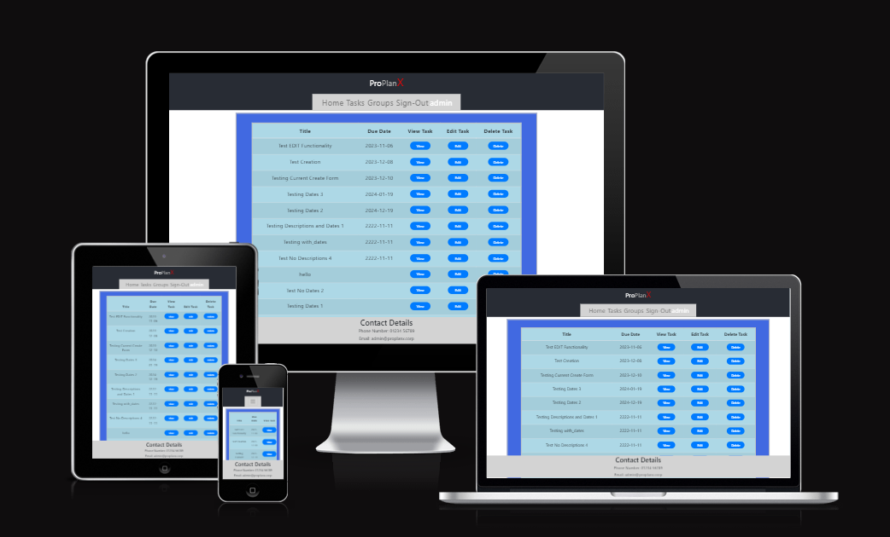
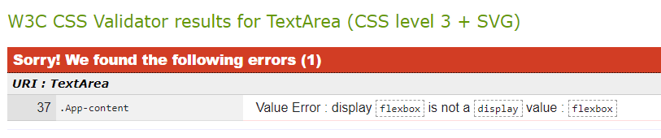
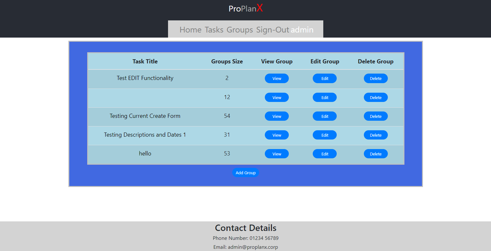

# PROJECT 5 - PRODUCTIVITY PLANNER 'PROPLANX' FRONT-END TESTING DOC

If you wish to view the final project itself, it was deployed to Heroku, and can be found here: [Deployed ProPlanX Project](https://project-5-proplanx-536622b745e3.herokuapp.com/)

If alternatively you wish to view the GitHub repo for this project, it can be found here: [ProPlanX GitHub](https://github.com/KeyWarden/Project-5-Productivity-Planner-Resubmission)

---

## CONTENTS

* [AUTOMATED TESTING](#automated-testing)
  * [W3C Validator](#w3c-validator)
  * [Eslint](#eslint)

* [MANUAL TESTING](#manual-testing)
  * [Testing User Stories](#testing-user-stories)
  * [Full Testing](#full-testing)

* [BUGS](#bugs)
  * [Known Bugs](#known-bugs)

---

## AUTOMATED TESTING

###  W3C Validator

The W3C validator was used to validate all the CSS used for this project.

Generally speaking, no issues were found, barring one exception. There was an error found that I could not resolve. This is because the error related to a specific styling choice I was lead to make in order to resolve a prior styling problem to ensure content is actually centered on the page at all times. During my search to resolve this issue, I was guided to make the change that is now being listed as an error by W3C. As I do not have the time to properly go over and resolve this particular issue without potentially disrupting the work already done, it unfortunately cannot be removed. The error image is shown below:

### ESLINT

Eslint was used to validate the JSX used for this project.

Almost no issues were found according to eslint, but unfortunately, what was found could not be resolved. In GroupTaskTitle.js eslint claims that 'task' is declared but never used. As far as I can tell, this isn't actually true, but I do not have enough time to fully investigate why eslint thinks otherwise and resolve whatever problem is found within. In spite of this, however, the code seems to function normally.

## MANUAL TESTING

### Testing User Stories

`New Customers`
| **Goals** | **Have they been achieved?** |
|-----|----|
| As a new customer, I would like to be immediately and clearly directed to the sign-up options so that I can get an account as quickly and easily as possible, as well as directed to sign-in similarly quickly so I can get back to managing my Tasks right away. | This has been achieved by making the Home Page inform signed-out users that they need to sign-in or sign-up and linking them directly to those options. They can also do so via the Navbar. |
| As a new customer, I would like to be immediately presented with ways to see my Tasks as soon as I sign in, so that I can immediately see which Tasks I have remaining and manage them. | Mostly. In the end it was deemed more expedient to provide users with immediately and prominently visible links to the Tasks page as well as a link in the Navbar. Quick and easy access is therefore still provided. |
| As a new customer, I would like to be notified if the deadline for my Tasks is approaching or has already passed, so as to be informed of how much time I have left to finish them, as well as if I need to delay them. | This unfortunately had to be dropped due to time constraints. |
| As a new customer, I would like to be able to access any socials or other web options for the app so that I can learn more about them if I should wish to do so. | This unfortunately had to be dropped due to time constrainsts and lack of need. |

`Returning Customers`
| **Goals** | **Have they been achieved?** |
|-----|----|
| As a returning customer, I would like to be presented with the ability to edit, remove, add, or otherwise change my Tasks upon being presented with them, so that I can easily manage them in detail. | This has been achieved by providing access to forms to add new Tasks and edit existing ones, as well as buttons that, when pressed, will delete the Task in question. |
| As a returning customer, I would like to be able to assign Tasks to Groups, in order to clearly show which Groups are assigned to which Tasks. Also, as a returning customer, I would like to be able to be able to easily edit, add, remove, or otherwise change my Groups, so that I can manage them in detail. | This has been achieved by providing access to forms to add new Groups and edit existing ones, as well as buttons that, when pressed, will delete the Task in question. Also, when creating or editing a Group, the user is presented with a selection of all Tasks they have produced in order to assign them to a Group. |
| As a returning customer, I would like to be able to contact the admin team in some way so as to get administrator support if a feature of the site is not functioning or I am currently indisposed. | This has been achieved by providing contact details for the admin staff in the Footer. |
| As a returning customer, I would like to be able to search through my Tasks in order to quickly find specific Tasks I am looking for. | Partially. Tasks and Groups are filtered so the user only sees the ones they created, and they are ordered by Due Date and Task Title respectively. All other search and filtering options had to be dropped due to time constraints. |
| As a returning customer, I would like to be notified if the deadline for my Tasks is approaching or has already passed, so as to be informed of how much time I have left to finish them, as well as if I need to delay them. | This unfortunately had to be dropped due to time constraints. |

`Client`
| **Goals** | **Have they been achieved?** |
|-----|----|
| As the client, I want the app to be easily viewable on a range of devices so as to not hinder the accessibilty of the app for non-desktop users. | This has been achieved by making the app responsive, such that the elements adjust size and style in response to different screen sizers, ensuring that everything remains legible and visible no matter the device being used. |
| As the client, I want there to be a clear way for users to contact the admin team in the event they should need to do so, such as to request admin assistance. | This has been achieved by providing contact details for the admin staff in the Footer. |

### Full Testing

Full testing was done on a laptop using the Google Chrome Browser as well as its in-built features for resizing the browser 'screen'.

Feature | Expected Outcome | Testing Performed | Result | Pass/Fail |
| --- | --- | --- | --- | --- |
| `Navbar` |
| Home Link | Redirects to home page | Click home link | Redirected to home page | Pass |
| Sign-in Link (user not signed in) | Redirect to Sign-in page | Click log in link | Redirected to sign-in page | Pass |
| Sign-up Link (user not signed in)  | Redirect to Sign-up page | Click sign up link | Redirected to sign-up page | Pass |
| Tasks link (user signed in) | Redirects the user to the tasks page | Click tasks link | Redirected to tasks page | Pass |
| Groups link (user signed in) | Redirects the user to the groups page | Click groups link | Redirected to groups page | Pass |
| Sign-out link (user signed in) | User will be signed out and redirected to home page | Click sign-out link| User signed out and redirected to home page | Pass |
| `Home Page` |
| Sign-in Links (user not signed in) | Redirect to Sign-in page | Click log in links | Redirected to sign-in page | Pass |
| Sign-up Links (user not signed in)  | Redirect to Sign-up page | Click sign up links | Redirected to sign-up page | Pass |
| Tasks links (user signed in) | Redirects the user to the tasks page | Click tasks links | Redirected to tasks page | Pass |
| Groups links (user signed in) | Redirects the user to the groups page | Click groups links | Redirected to groups page | Pass |
| `Sign-in Page` |
| Form - link to sign-up page | Redirects user to sign up page | Click link | Redirected to sign-up page | Pass |
| Form - Submission with no information | User prompted to fill in information | clicked Sign In button with no fields filled out | Form declared fields may not be blank | Pass |
| Form - Submission with information | Signs in and redirects to home page | clicked Sign In button with all fields filled out | Signed in and redirected to home page | Pass |
| `Signup Page` |
| Form - link to sign-in page | Redirects user to sign-in page | Click link | Redirected to sign-in page | Pass |
| Form - Submission with no information | User prompted to fill in information | clicked Sign Up button with no fields filled out | Form declared fields may not be blank | Pass |
| Form - Submission with taken username | User prompted to use a different username | clicked Sign Up button with taken username | Form declared username taken | Pass |
| Form - Submission with information | Signs up and redirects to home page | clicked Sign Up button with all fields filled out | Signed up, not redirected to home page | Partial Pass |
| `New Task Page` |
| Form - Submission with no information | User prompted to fill in required fields | clicked create button with no fields filled out | Form prompted to fill in first empty required field | Pass |
| Form - Submission with information | Task submits and redirects to tasks page | clicked create button with all fields filled out | Task submitted and redirected to tasks page | Pass |
| Cancel button | Redirects to tasks page | clicked cancel button | Redirected to tasks page | Pass |
| `New Group Page` |
| Form - Submission with no information | User prompted to fill in required fields | clicked create button with no fields filled out | Form prompted to fill in first empty required field | Pass |
| Form - Submission with information | Group submits and redirects to groups page | clicked create button with all fields filled out | Group submitted and redirected to groups page | Pass |
| Cancel button | Redirects to groups page | clicked cancel button | Redirected to groups page | Pass |
| `Edit Task Page` |
| Form - Submission with no information | User prompted to fill in required fields | clicked save button with no fields filled out | Form prompted to fill in first empty required field | Pass |
| Form - Submission with new information | Task updates and redirects to tasks page | clicked save button with all fields filled out with new information | Task updated and redirected to tasks page | Pass |
| Cancel button | Redirects to tasks page | clicked cancel button | Redirected to tasks page | Pass |
| `Edit Group Page` |
| Form - Submission with no information | User prompted to fill in required fields | clicked save button with no fields filled out | Form prompted to fill in first empty required field | Pass |
| Form - Submission with new information | Group updates and redirects to groups page | clicked save button with all fields filled out with new information | Group updated and redirected to groups page | Pass |
| Cancel button | Redirects to groups page | clicked cancel button | Redirected to groups page | Pass |
| `Tasks Page` |
| View button | Redirects to specific task page for the task in question | clicked view button | Redirected to specific task page for the task in question | Pass |
| Edit button | Redirects to edit task page for the task in question | clicked edit button | Redirected to edit task page for the task in question | Pass |
| Delete button | Deletes task and refreshes tasks page | clicked delete button | Deleted task and refreshed tasks page | Pass |
| Add Task button | Redirects to new task page | clicked add task button | Redirected to new task page | Pass |
| `Groups Page` |
| View button | Redirects to specific group page for the group in question | clicked view button | Redirected to specific group page for the group in question | Pass |
| Edit button | Redirects to edit group page for the group in question | clicked edit button | Redirected to edit group page for the group in question | Pass |
| Delete button | Deletes group and refreshes groups page | clicked delete button | Deleted group and refreshed groups page | Pass |
| Add Task button | Redirects to new group page | clicked add group button | Redirected to new group page | Pass |
| Task Title Link | Redirects to specific task page for the task in question | clicked task title link | Redirected to specific task page for the task in question | Pass |
| `Specific Task Page` |
| Edit button | Redirects to edit task page for the task in question | clicked edit button | Redirected to edit task page for the task in question | Pass |
| Delete button | Deletes task and refreshes tasks page | clicked delete button | Deleted task and refreshed tasks page | Pass |
| `Specific Group Page` |
| Edit button | Redirects to edit group page for the group in question | clicked edit button | Redirected to edit group page for the group in question | Pass |
| Delete button | Deletes group and refreshes groups page | clicked delete button | Deleted group and refreshed groups page | Pass |
| `Not-The-Owner Page` |
| Return to Tasks Link | User will be redirected to the tasks page | Click return to tasks link | Redirected to the tasks page | Pass |

## BUGS

### Known Bugs

There are only two bugs that I am aware of that persist within the app, however, one of these is exclusive to the development version of the app.

The first, which is exclusive to development, is what I call the Missing-Title bug. It's a bug that occurs when five or more groups are registered to a user at any time while they are viewing the Groups Page. Seemingly at random, one of the Groups will have its associated Task Title field in the table be empty. I have never managed to find the cause of this bug, but given that it has not occured so far in the deployed version, I am content to leave it be for now. See below for an example of the bug in action.

The second is more annoying. It occurs when Signing Up. Upon filling out the form and submitting on the Sign-up Page, the user is left with no feedback that they have signed up. I have confirmed the submission itself works, the new account is created, but for reasons unknown the code to redirect the user to a new page does not trigger. Even after changing the destination from the Sign-In page to the Home page, nothing happens, forcing the user to change to the Sign-In page manually. This was not my intention, but nothing I have tried has worked to solve this error, and I do not have the time to attempt any furhter fixes, so it will remain unresolved for now.